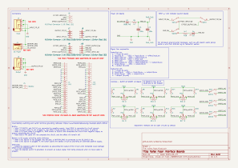

# Noise Floor interface board collection

This is set of interface boards to speed effect pedal development, continuing my efforts to learn PCB design with [KiCAD](https://www.kicad.org/).

### IO PCB
The first board is an audio input and power board, featuring:
  - Switched DC barrel jack supporting either a 9VDC center negative supply or 9V battery
  - Mono audio jacks w/ switched input circuit (ring/ground shorted to sleeve on insertion)
  - Basic power input protection

The IO PCB is designed to fit in a standard 125B enclosure.

### Switch PCB
The second board simplifies effect bypass via a 3PDT switch adapter with an LED indicator.

### UX PCB (experimental)
The third and newest (experimental) board, intended to connect to an effects board using two 25-pin [Amphenol "Conan Lite"](https://www.amphenol-cs.com/product-series/conan-lite-1-00mm.html) board-to-board connectors, providing a standard superset of potentiometers and switches. 

### Connectivity
IO and Switch boards are connected using four-circuit [Molex PicoBlade](https://www.molex.com/molex/products/family/picoblade?parentKey=wire_to_board_connectors) connectors.

Headers are labelled symmetrically from the perspective of the IO board:
 - **S**1 on IO Board <-> **S**1 on **S**witch Board
 - **S**2 on IO Board <-> **S**2 on **S**witch Board
 - **E**1 on IO Board <-> **E**1 on **E**ffect Board

[Schematic PDF](schematics/noise_floor-latest.pdf)

## Credit

The original idea and specific bypass circuit is inspired by many manufacturers of utility PCBs and well-known circuits for 3PDT-based effect bypass, notably [PedalPCB's 3PDT breakout](https://www.pedalpcb.com/product/3pdt/), augmented to suit my needs.

Thanks as always to the folks on the [freestompboxes.org](https://www.freestompboxes.org/) forum for feedback and suggestions.

Potentiometer and DC barrel jack 3D models courtesy [Vasily Kashirin](https://grabcad.com/vasily.kashirin-1).

SPDT toggle switch 3D model courtesy [Stephanie Schwecke](https://grabcad.com/stephanie.schwecke-1).

Conan Lite footprints adapted from the 51-position footprints available from SnapEDA: [Header](https://www.snapeda.com/parts/10162582-1134151LF/Amphenol%20ICC%20(FCI)/view-part/), [Receptacle](https://www.snapeda.com/parts/10162581-3134151LF/Amphenol%20ICC%20(FCI)/view-part/).([Additional license details](hardware/SnapEDA_Licensing.txt)). 3D models courtesy Amphenol.

*I am not affiliated with any of the brands, sites, or products named in this overview.*

## Future plans

 - Build an IO board that includes a TRS expression pedal input (started this way, but found it hard to fit in a 125B enclosure)
 - Support stereo operation via relays, optoisolators, or a "millenium" switch
 - Build standardized interface boards (e.g. 2 & 3 potentiometers, some TBD configuration of SPDT or DPDT toggle switches, etc)

## Versioning

My pcb designs utilize the following versioning scheme (I'll add to this as I produce more revisions):
 - v0.0XX: A candidate design that has not yet been produced and tested.
 - v0.XX: A design that has been produced, tested, and any initial errors addressed.

## Name
*The name Noise Floor is a reflection of the function of the board (a substrate for pedals and bypass circuit) and security nerdery.*
