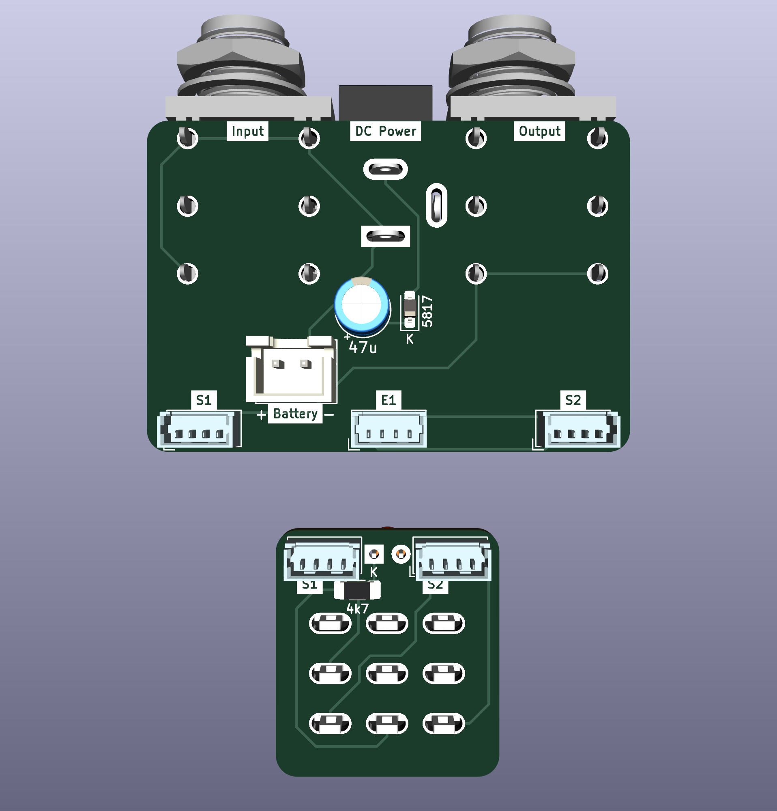
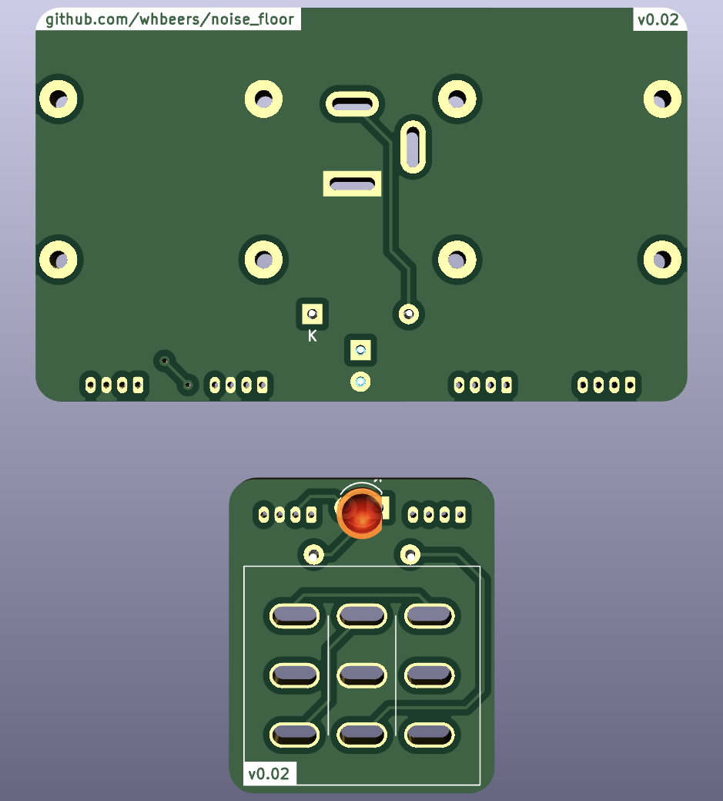

# Noise Floor interface board collection

This is set of interface boards to speed effect pedal development, continuing my efforts to learn PCB design with [KiCAD](https://www.kicad.org/).

### IO PCB
The first board is an IO (mono audio) and 9VDC center negative power board designed to fit in a 125B standard enclosure.

### Switch PCB
The second board simplifies effect bypass via a 3PDT switch adapter.

### Connectivity
Boards are connected using four-circuit Molex PicoBlade connectors. In retrospect, a six-circuit connector would have made more sense. That said, I've already purchased a pile of four-circuit headers and cable assemblies, and the current design maintains some degree of backwards compatibility with my existing effect circuits, as well as the PedalPCB Auditorium test platform.

Current and future pedal designs will be updated to utilize the dual PicoBlade IO connectors instead instead of soldered wires.

Headers are labelled symmetrically from the perspective of the IO board:
 - **S**1 on IO Board <-> **S**1 on **S**witch Board
 - **S**2 on IO Board <-> **S**2 on **S**witch Board
 - **E**1 on IO Board <-> **E**1 on **E**ffect Board
 - **E**2 on IO Board <-> **E**2 on **E**ffect Board

[Schematic](hardware/NoiseFloor_schematic_v0.01.pdf)

## Credit

The idea and specific bypass circuit is inspired by many manufacturers of utility PCBs and well-known circuits for 3PDT-based effect bypass, notable [PedalPCB's 3PDT breakout](https://www.pedalpcb.com/product/3pdt/), augmented to suit my needs.

## Future plans

 - Build an IO board that includes a TRS expression pedal input (started this way, but found it hard to fit in a 125B enclosure)
 - Migrate power input protection and indicator LED to IO board
 - Support stereo operation via relays, optoisolators, or a "millenium" switch
 - Build standardized interface boards (e.g. 2 & 3 potentiometers, some TBD configuration of SPDT or DPDT toggle switches, etc)

## Versioning

My pcb designs utilize the following versioning scheme (I'll add to this as I produce more revisions):
 - v0.0XX: A candidate design that has not yet been produced and tested.
 - v0.XX: A design that has been produced, tested, and any initial errors addressed.

The current version of the  Noise Floor interface board is v0.01.

## Name
*The name Noise Floor is a reflection of the function of the board (a substrate for pedals and bypass circuit) and security nerdery.*
