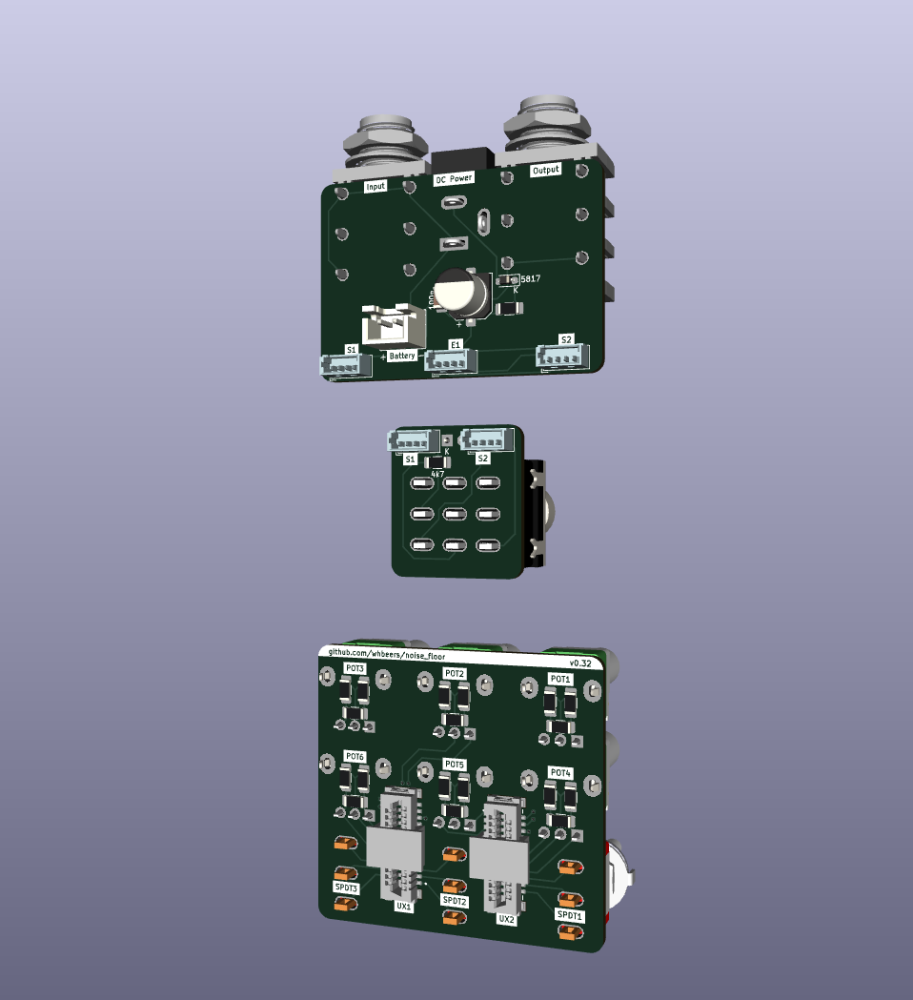
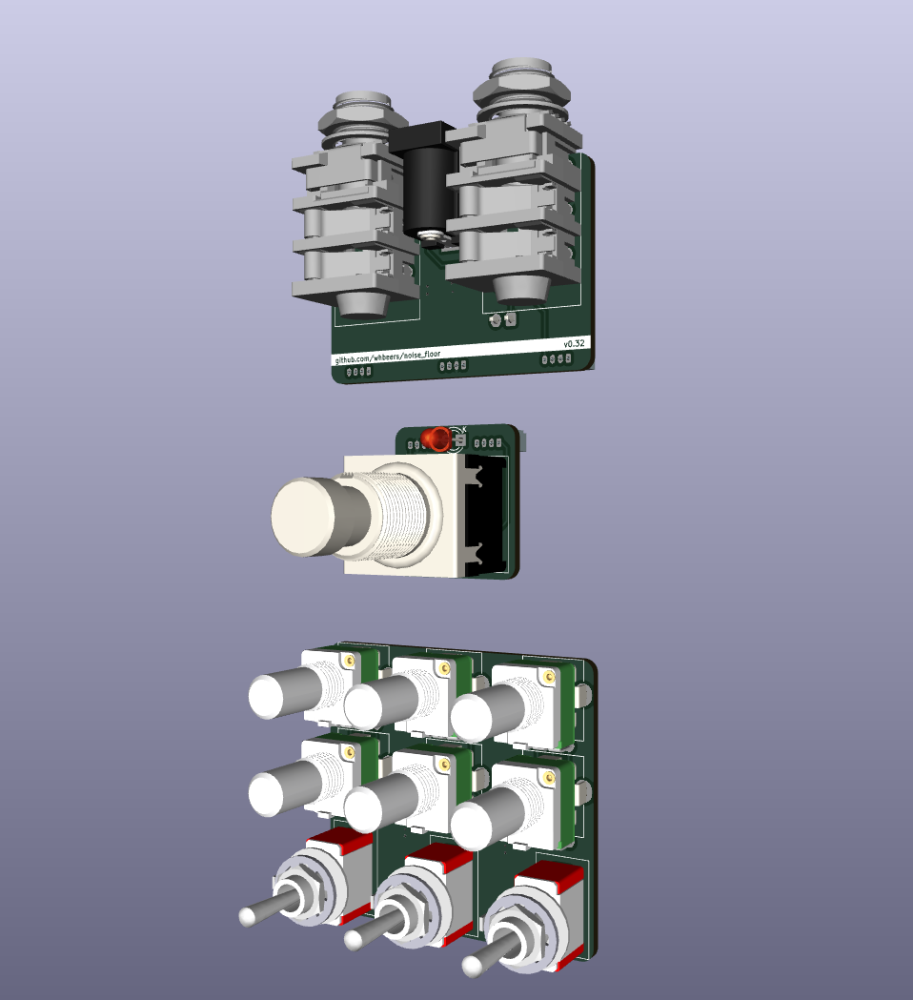

# Noise Floor interface board collection

This is set of interface boards to speed effect pedal development, continuing my efforts to learn PCB design with [KiCAD](https://www.kicad.org/).

### IO PCB
The first board is an IO (mono audio) and 9VDC center negative power board with basic power input protection, designed to fit in a 125B standard enclosure.

### Switch PCB
The second board simplifies effect bypass via a 3PDT switch adapter with an LED indicator.

### Connectivity
Boards are connected using four-circuit [Molex PicoBlade](https://www.molex.com/molex/products/family/picoblade?parentKey=wire_to_board_connectors) connectors.

Headers are labelled symmetrically from the perspective of the IO board:
 - **S**1 on IO Board <-> **S**1 on **S**witch Board
 - **S**2 on IO Board <-> **S**2 on **S**witch Board
 - **E**1 on IO Board <-> **E**1 on **E**ffect Board

[Schematic](hardware/NoiseFloor_schematic_v0.03.pdf)

## Credit

The idea and specific bypass circuit is inspired by many manufacturers of utility PCBs and well-known circuits for 3PDT-based effect bypass, notable [PedalPCB's 3PDT breakout](https://www.pedalpcb.com/product/3pdt/), augmented to suit my needs.

## Future plans

 - Build an IO board that includes a TRS expression pedal input (started this way, but found it hard to fit in a 125B enclosure)
 - Support stereo operation via relays, optoisolators, or a "millenium" switch
 - Build standardized interface boards (e.g. 2 & 3 potentiometers, some TBD configuration of SPDT or DPDT toggle switches, etc)

## Versioning

My pcb designs utilize the following versioning scheme (I'll add to this as I produce more revisions):
 - v0.0XX: A candidate design that has not yet been produced and tested.
 - v0.XX: A design that has been produced, tested, and any initial errors addressed.

The current version of the Noise Floor interface board is v0.03.

## Name
*The name Noise Floor is a reflection of the function of the board (a substrate for pedals and bypass circuit) and security nerdery.*
